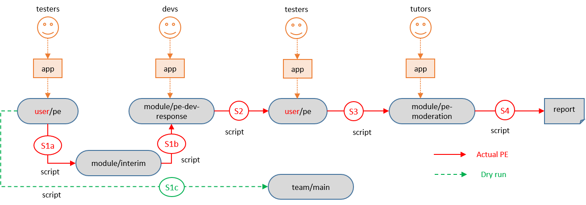

# Issue Templates



## Bug Reporting Phase

### [App] Collect Bug Reports

* Title and body as the tester entered.
* Labels: `severity.*`, `type.*` (both compulsory)

### [Script] Tester-Repo → Interim-Repo

**Note: issue title remains the same as the original issue, throughout the workflow**

Issue body:
```
{original issue description}

<hr>
<sub>[original: username/repo-name#issue-number]</sub>
```
Example:

>The app doesn't work
>
><hr>
><sub>[original: johnDoe/pe#1234]</sub>

Notes:
* Only open issues are to be transferred.
* Copy the `severity.*` label. If no severity label, apply `severity.Low`
* Copy the `type.*` label.
* Apply the correct `tutorial.*` label and `team.*` label to indicate the receiving team
* Transfer image files to the new repo and update the link in the issue body.
* Check the timestamp. Only bugs reported within the PE period should be transferred. Add a comment to issues falling outside the accepted time window.
  >Bug report not accepted as it was modified outside the time window `{start time}-{end time}`

### [Script] Interim-Repo → Dev-Repo

Body:
```
{issue description: same as interim}

<hr>
<sub>[original: module-org/repo-name#issue-number]</sub>
```

Notes:
* Copy all labels


## Dev Response Phase

### [App] Collect Dev Response

Body:
```
{same as interim repo}
```
Add a comment:
```
# Team's Response

{team's response}

## Duplicate status (if any):
Duplicate of #{issue-number}
```
Example:

># Team's Response
>Yes, we missed this.
>But it's a minor bug.
>
>## Duplicate status (if any):
>Duplicate of #1234

Labels: `severity.*`, `type.*`, `response.*`, `duplicate`

### [Script] Dev-Repo → Tester-Repo

Add a comment to the original issue in `tester/repo-name`, in the following format:

```
# Team's Response

{team's response}

# Items for the Tester to Verify
## :question: {type of verification}

{description}

- [ ] I disagree

**Reason for disagreement:**
[replace this with your reason]

-------------------
```
Example:

># Team's Response
>
>Description of team's response
># Items for the Tester to Verify
>## :question: Bug not accepted
>
>Team responded `response.Rejected`
>
>- [ ] I disagree
>
>**Reason for disagreement:**
>[replace this with your reason]
>
>-------------------
>## :question: Downgrade of severity
>
>Changed from `High` to `Low`
>
>- [ ] I disagree
>
>**Reason for disagreement:**
>[replace this with your reason]
>
>-------------------
>## :question: Change of type
>
>Changed from `X` to `Y`
>
>- [ ] I disagree
>
>**Reason for disagreement:**
>[replace this with your reason]
>
>-------------------

Notes:
* If the issue is a duplicate, it should inherit seveirty, type, and response from the "original" issue.
  * Change the labels accordingly
  * Add the "original" response to the duplicate's response (if any).

## Tester Response Phase

### [App] Collect Tester Response

Update the comment. Example:

>## :question: Change of type
>
>Changed from `X` to `Y`
>
>- [x] I disagree
>
>**Reason for disagreement:**
>It's a bug, not a typo.
>
>-------------------

### [Script] Tester-Repo → Tutor-Repo

Body:
```
# Issue Description
{original issue description}

# Team's Response
{team's response}

# Disputes

## :question: {type of verification}

### Team says:
{team's justification}

### Tester says:
{tester's objection}

```

Example:
>...
># Disputes
>## :question: Downgrade of severity
>### Team says:
>Yes, we missed this.
>But it's a minor bug.
>### Tester says:
>I think it should be medium.
>Most users are affected.


## Moderation Phase

### [App] Collect Tutor Response

* Show ticks for each dispute
* Add a comment to record tutor response
```
# Tutor Moderation

## {type of verification}

{tutor explanation}
```
Example:
># Tutor moderation
>## :question: Downgrade of severity 
>I think it is justified.
>## :question: Change of type 
>Not justified. I've changed it back.

* Allow tutor to change other labels
* Set `status.Done` label if all tasks are done
* Allow adding an `Unsure` label, in case the tutor is unsure about the decision
